<p align="center">
  
</p>

<p align="center">
  <a href="README.md">🇫🇷 Français</a> · <strong>🇬🇧 English</strong>
</p>

<p align="center">
  <strong>🎮 One idea. A few iterations. A new game to play.</strong><br/>
  <sub>A growing arcade built through vibe coding.</sub>
</p>

<p align="center">
  🧠 IDEA &nbsp;→&nbsp; 🤖 AI &nbsp;→&nbsp; 🕹️ PLAY &nbsp;→&nbsp; 💭 REACT &nbsp;→&nbsp; ✨ EVOLVE
</p>

---

## 🕹️ Welcome to Vibe Arcade

**Vibe Arcade** is a collection of games that begin with a feeling, a weird idea, or a simple *“wouldn't it be cool if…?”*

No traditional game-design document has to come first. No framework has to be chosen before the fun exists. The desired experience comes first; AI turns it into something playable; then we play it, react to it, change direction, add ideas, remove boring parts, and keep going until it feels right.

> **The code is not the attraction. The playable result is.**

The source is public. The private conversations used to steer development are **not archived in this repository**.

---

# 🧱 CABINET #002

## **Stack Panic**

> *Everything is under control.*

A **falling-block game** that refuses to behave. You stack, you clear lines — and the chaos director sends in sheep that shove cells around, water that pours into the holes, a bomb, a tank, a blackout, an inspecting duck, or a **structural breach**: the game opens into 3D and you fly a ship through a tunnel built out of your own stack.

Since **v1.0 — NO MERCY**, no incident is on your side any more: blocks never just vanish, they get displaced, buried or thrown back on top of your stack. Chaos rises on its own, a new level lands every 30 seconds and a tide of rubble pushes up from the floor more and more often. Every run ends up breaking — the only question is when.

`🐑 sheep` · `💧 slippery controls` · `💣 rubble` · `🪖 backfill tank` · `🌑 blackout` · `📼 inverted controls` · `🦆 quality-control duck` · `🌀 3D breach` · `☀️ daily challenge` · `👤 player accounts` · `🏆 online leaderboards`

➡️ **[Play Stack Panic](https://arcade.mjodheim.be/stack-panic/)** · [the code and the game notes](games/stack-panic)

---

# 🍎 CABINET #003

## **Forbidden Fruit**

> *Snake, but you're the apple.*

You run. Three snakes hunt you: **the Chaser** goes straight for you, **the Ambusher** aims where you're going, **the Drunk** zigzags at random. They keep growing and speeding up, and a new one arrives every 22 seconds. A snake that hits a wall, itself or another snake explodes into seeds (+500, ×2, ×3 combos…): the real game is making them take each other out.

➡️ **[Play Forbidden Fruit](https://arcade.mjodheim.be/forbidden-fruit/)**

---

# 🐦 CABINET #004

## **Pigeon Control**

> *Control tower, this is pigeon.*

Draw each pigeon's route, with the mouse or a finger, to the monument of its colour. Two pigeons touching ends your shift. Featuring fat pigeons, ninja pigeons, seagulls that answer to nobody, and a kid throwing bread at the worst possible moment.

➡️ **[Play Pigeon Control](https://arcade.mjodheim.be/pigeon-control/)**

---

## 🧪 The Vibe Loop

```text
         💡 "What if...?"
                │
                ▼
          🤖 BUILD IT
                │
                ▼
          🎮 PLAY IT
          ╱          ╲
      😍 FUN        😐 MEH
        │             │
        │             ▼
        │       💭 "Change this..."
        │             │
        └──────┬──────┘
               ▼
            ✨ EVOLVE
               │
               └──────────↺
```

You do not need to describe APIs, classes, engines, databases, or patterns to influence the game.

Useful input can simply be:

> *“The mage doesn't feel powerful enough.”*
>
> *“I want loot that can completely change my build.”*
>
> *“This boss is boring.”*
>
> *“Let me remap the controls.”*
>
> *“I want to play one more run.”*

That last one is the important one. 😈

---

# 👾 The Arcade Floor

| Cabinet | Game | Genre | Status |
|:--:|---|---|:--:|
| `#002` | 🧱 **Stack Panic** | Chaotic falling-block puzzle | 🟢 PLAYABLE |
| `#003` | 🍎 **Forbidden Fruit** | Reverse Snake | 🟢 PLAYABLE |
| `#004` | 🐦 **Pigeon Control** | Pigeon air traffic control | 🟢 PLAYABLE |
| `#004` | ❔ **???** | ??? | 🔒 LOCKED |

Future games can share the same arcade identity, player profiles, achievements, and per-game leaderboards while remaining completely different experiences.

---

## 🏆 Arcade ambitions

As the cabinet grows, Vibe Arcade is intended to gain a shared layer around the games:

- ✅ 👤 one player identity across the arcade
- ✅ 🏆 a leaderboard for every game
- 🥇 daily and all-time challenges
- 🎖️ cross-game achievements
- 📊 personal records and arcade statistics
- 🎲 wildly different games built from new ideas

The important constraint remains the same: **the player steers the product through ideas, playtesting, and natural-language feedback rather than manually implementing the gameplay.**

---

## 🚀 Run the arcade

Everything runs in **a single Node process** (`server/`): the landing page, every cabinet under `/<game>/`, and the account/leaderboard API. No npm dependencies, Node 20+.

```bash
npm run dev    # http://localhost:8080 — auto-reload, data in ./data
npm test       # server, API, game logic + Stack Panic smoke test
```

### On the VPS (Docker)

```bash
cp .env.example .env          # set a long random ARCADE_SECRET
docker compose up -d --build  # listens on 127.0.0.1:8080
```

- Accounts and scores live in the `arcade_data` volume (`/app/data/arcade.json`).
- Put the existing reverse proxy (Nginx, Caddy…) in front of `127.0.0.1:8080` for HTTPS. Keep `TRUST_PROXY=1` so login rate limiting sees real client IPs.
- Update: `git pull && docker compose up -d --build`.

---

## 🗂️ Behind the cabinets

```text
Vibe-Arcade/
├── 🎮 games/
│   ├── 🧱 stack-panic/     # Game #002
│   ├── 🍎 forbidden-fruit/ # Game #003
│   └── 🐦 pigeon-control/  # Game #004
├── 🖥️ server/               # Node server: site, games, accounts & leaderboards
├── 🐳 Dockerfile · docker-compose.yml
├── 🤝 shared/               # Account client shared by every cabinet
├── 🎨 assets/               # Arcade visuals
├── 📚 docs/
│   └── PHILOSOPHY.md        # What the experiment explores
├── 📖 README.md             # Français
└── 📖 README.en.md          # English
```

---

<p align="center">
  <strong>✨ HAVE AN IDEA. PLAY THE RESULT. ✨</strong>
</p>

<p align="center">
  <sub>Vibe Arcade — built one strange idea at a time.</sub>
</p>
