<p align="center">
  
</p>

<p align="center">
  <strong>🐝 Vibe Arcade — Cabinet #001</strong><br/>
  <sub>3D fantasy action-adventure roguelite · playable prototype v0.3</sub>
</p>

---

# 🌼 The Bloom is fading

Beyond the hive, the old gardens are changing.

Flowers glow where they should not. Ancient wax shrines hum in the dark. Strange relics surface beneath corrupted roots. The deeper a bee ventures into the Bloom, the stronger the **Gloam** becomes — and the greater the rewards.

You fly it yourself now. Every node of a run is a **glade** you walk into: rolling ground, giant mushrooms, ruined wax pillars, drifting pollen — and, at the far end, gates that show you exactly what you are choosing to walk into next.

Choose a role. Build something ridiculous. Defeat what waits beyond the petals. Decide how long you're willing to risk the run.

> **Survive. Adapt. Become gloriously overpowered. Score higher. Go again.**

---

## 🐝 Choose your bee

| Class | Role | Fantasy |
|:--|:--|:--|
| 🛡️ **Waxguard** | Warrior | Heavy wax armor, retaliation and staying power |
| ✨ **Bloomweaver** | Mage | Arcane pollen, bursts and magical destruction |
| 🏹 **Thornstrider** | Ranger | Speed, precision and critical-hit builds |
| 🎶 **Hymnkeeper** | Support | Auras, swarm power and strange supportive magic |

Each class is intended to feel different rather than simply carrying different stat bonuses.

---

## ⚔️ The run

```text
            🐝 ENTER A GLADE
                   │
         ┌─────────┴──────────┐
         │                    │
   🔎 EXPLORE IT        ⚔️ FIGHT WHAT
  motes · secrets       CRAWLS OUT
  hidden caches         of the rift
         │                    │
         └─────────┬──────────┘
                   ▼
              🌿 GROW
        talents · relics · craft
                   │
                   ▼
        🚪 THREE GATES, ONE CHOICE
        each one shows its risk
                   │
                   ▼
              👑 GUARDIAN
                   │
                   ▼
            🌑 GLOAM PACT
           safer?   greedier?
                   │
                   ▼
          ❂ NEXT BIOME, DEEPER ↺
```

Four glades and a Guardian make a region. Five biomes cycle: the **Verdant Reach**, the **Mycelian Deep**, the **Ashen Orchard**, the **Moonlit Fen** and the **Crownless Garden** — each with its own light, weather, vegetation and colour of dread.

```

The further you push, the more dangerous the run becomes — and the more valuable your score multiplier can become.

---

## 💎 Buildcraft

Relics carry one of five **Sigils**. Stack matching Sigils and they awaken **Resonances** that reshape a build.

| Sigil | Identity |
|:--:|---|
| 🟡 **Wax** | durability, armor and retaliation |
| 🌸 **Bloom** | raw damage and chain explosions |
| 🌹 **Thorn** | speed, critical hits and aggression |
| 🔊 **Echo** | ability tempo and repeated effects |
| 🌑 **Gloam** | dangerous power and score multipliers |

The goal is not perfect balance at all times. Part of the fun is discovering combinations that become **beautifully unfair**.

---

## 🍯 What's playable now?

`🌍 3D procedural glades` · `⚔️ real-time combat` · `🐛 four creature archetypes` · `👑 three-phase Guardian` · `💎 four loot rarities` · `🌿 randomized talents` · `🔨 crafting` · `🌀 Sigil Resonances` · `🌑 Gloam Pacts` · `🗝 hidden caches` · `📈 endless scaling` · `🏆 all-time leaderboard` · `☀️ Daily Hive`

Also included:

- 🎥 third-person camera, mouse aim and a dodge with invulnerability frames
- 🌾 wind-animated vegetation, drifting pollen, embers, spores and fireflies
- 🔊 fully synthesised sound: no audio files, every biome tuned like an instrument
- 🎚️ three graphics presets (shadows, bloom, particle density)
- 👤 account registration and login
- 🎟️ run tokens with basic score validation
- 💾 persistent prototype data
- 🎲 deterministic Daily Hive seed shared by every player
- ⌨️ fully configurable keyboard controls
- 🇫🇷 French first, English second — everything the player can read is translated,
  including the signposts painted on the gates, and a test suite fails the build
  if a new string forgets its French form
- 🇫🇷 friendly ZQSD/AZERTY preset
- 🐳 Docker-ready deployment
- 📦 zero runtime npm dependencies (three.js is vendored in `public/vendor/`)

---

## 🎮 Controls

| Input | Action |
|:--|:--|
| `W A S D` | fly, relative to the camera |
| Mouse | aim |
| Left click (hold) | attack |
| `Space` | class ability |
| `Shift` | dash — short, fast, and briefly untouchable |
| `E` | interact with a shrine, a cache, a petal |
| Right-drag | turn the camera · wheel zooms |
| `Esc` | pause, graphics quality, sound |

Open **⚙ Controls** to rebind anything. Quick presets: `WASD` · `ZQSD / AZERTY` · `Arrow Keys`. Bindings are stored locally in the browser and duplicates are rejected.

If you are not holding attack, shots auto-target the nearest enemy in range, so the attention stays on **movement, positioning, abilities and build decisions**.

---

## ☀️ Daily Hive

Every day, everyone can enter the same deterministic challenge.

Same seed. Same underlying route generation. Same opportunity.

The idea is simple:

> **Who makes the most out of today's hive?**

---

## 🏆 Score chasing

Hivebound is the first game in Vibe Arcade's shared leaderboard direction.

A run rewards progression, kills, bosses, loot and risk. Gloam can push the multiplier higher — if the run survives long enough to cash it in.

Long-term, Vibe Arcade is intended to expose a player profile with records across every cabinet.

---

# 🚀 Play locally

### Node.js 20+

```bash
export HIVEBOUND_SECRET='a-long-random-secret'
node server.js
```

Then visit:

```text
http://localhost:8080
```

### Docker / VPS

```bash
cp .env.example .env
# Set HIVEBOUND_SECRET in .env

docker compose up -d --build
```

The container exposes port `8080` and can sit behind an existing reverse proxy / TLS setup.

---

## 🧱 How it is built

```text
public/js/
├── core/     the game itself — pure JavaScript, no DOM, no WebGL
│   ├── rng.js      seeded random + value noise
│   ├── rules.js    classes, talents, relics, sigils, stats
│   ├── biomes.js   palettes, lighting, creature tables
│   ├── world.js    glade generation (terrain, props, gates, secrets)
│   ├── sim.js      movement, combat, creature AI, waves, Guardian phases
│   └── run.js      run progression and the choices it offers
├── render/   three.js presentation — reads the simulation, never writes to it
│   ├── view.js     renderer, sky, light, fog, bloom, camera rig
│   ├── props.js    procedural vegetation geometry
│   ├── glade.js    terrain mesh, instanced props, landmarks, gates
│   └── actors.js   the bee, the creatures, projectiles, impacts
├── i18n/     the French layer: translations and composition rules, DOM-free
├── audio.js  synthesised music and sound effects
├── game3d.js input, frame loop, and the wiring between the three
└── app.js    screens, HUD, modals, account
```

That split is the point: because the simulation never touches the browser, a
whole run can be played headlessly in `node --test`, and the renderer can be
rebuilt without putting a single rule at risk.

---

## ⚠️ Prototype cave

This is a playable prototype, not a finished competitive game.

The server performs basic run validation, but a determined player can still manipulate a browser client. A serious competitive leaderboard should eventually use replay/event validation or more server-authoritative simulation.

The 3D layer needs a WebGL2 browser. There is no fallback renderer; a machine that cannot run WebGL2 cannot run the game.

Persistence is deliberately lightweight for now. The current JSON layer keeps the prototype dependency-free; the shared Vibe Arcade identity and leaderboard layer can later move to PostgreSQL when the arcade grows.

---

<p align="center">
  <strong>🌼 ENTER THE BLOOM · EMBRACE THE GLOAM 🌑</strong>
</p>
